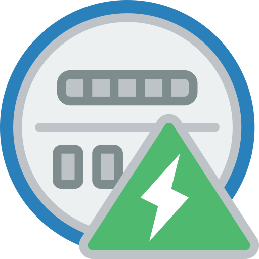

  

# Home Assistant - Meter Parser AddOn
[![BuyMeCoffee][buymecoffeebadge]][buymecoffee] ![Checks][checksbadge]
![Last release][releasebadge]

This is a Home Assistant AddOn (not HACS) to allow parse of dial and digits utility meters like water, gas, and electricity to provide energy consumption information to home assistant using a regular ip camera.

This repository is under alpha stage, so expect bugs and breaking changes.

### Highlights of what **Meter Parser** can do

* Parse Meters
* Provide a consumption sensor of `total_increasing` state type.
* Cheap IP or PoE cameras must do.
* Sensor may be used by energy panel in home assistant, or [Utility Meter](https://www.home-assistant.io/integrations/utility_meter/) integration to provide statistics and costs by any time span (monthly, daily, etc.)

### Potential Downsides

* Positioning a camera and getting a good image could be difficult.
* Could be hard to setup calibration parameters.
* To recognize digits, this project relys on OCR services on the internet. I am open to 
suggestions on better local libraries to scan digits. Recognizing dials is simple and local,
no internet connection or APIs are required.

## Installation through Supervisor

1. Add [https://github.com/junalmeida/homeassistant-addons](https://github.com/junalmeida/homeassistant-addons) as a custom
   repository on supervisor repositories.
2. Click install under "Meter Parser" in the Add-on Store.
3. If you have native MQTT enabled, supervisor may provide configuration. Otherwise, setup mqtt host, port, user, and password.
3. Setup the meter camera snapshot url, dials or digits. See the example below.
4. Start the add-on 
5. Print two 4x4 ArUco markers (https://chev.me/arucogen/) and stick on the top-left and bottom-right (order is important) of the region of interest. 
6. Check the logs add on and MQTT devices to see the last processed image and potential failures.


## Usage

* Entities will show up as `sensor.<friendly name>`, for example (`sensor.water_meter`).
```yaml
# Add-on configuration example
cameras:
- snapshot_url: http://192.168.100.153/snapshot.jpg
  name: Water Meter
  interval: 60 # seconds
  ocr_key: "123456789" # required for digits, grab a key at https://ocr.space/ (watch for rate limits)
  digits: 6 # required for digits, number of expected total digits (including decimals)
  decimals: 1 # optional number of decimals
  device_class: water # energy, gas or water
  unit_of_measurement: m³ # m³, ft³, kWh, MWh, Wh, gal, L

mqtt:
  host: hostname
  username: johndoe
  password: verysecurepwd
  port: 1883

log_level: INFO # DEBUG, INFO, WARN, ERROR
``` 

## Reporting an Issue

1. File an issue in this Github Repository, add logs and if possible an image of your meter.


## Credits
🎉 [Dial Parser](meterparser/src/app/parsers/parser_dial.py) code is based on the awesome work of [@mirogta](https://github.com/mirogta), please [support his work](https://github.com/mirogta/dial-meter-reader-opencv-py).


[^1]: Icons made by [Smashicons][iconcredit] from [flaticon.com][iconcreditsite]

[iconcredit]: https://www.flaticon.com/authors/smashicons
[iconcreditsite]: https://www.flaticon.com/
[buymecoffee]: https://www.buymeacoffee.com/junalmeida
[buymecoffeebadge]: https://img.shields.io/badge/buy%20me%20a%20coffee-donate-orange?style=plastic&logo=buymeacoffee
[checksbadge]:https://img.shields.io/github/checks-status/junalmeida/homeassistant-addons/main?style=plastic
[releasebadge]:https://img.shields.io/github/v/release/junalmeida/homeassistant-addons?style=plastic&display_name=tag&include_prereleases
<!-- [hacs]:https://github.com/hacs/integration
[hacsbadge]:https://img.shields.io/badge/HACS-Custom-41BDF5.svg?style=plastic -->